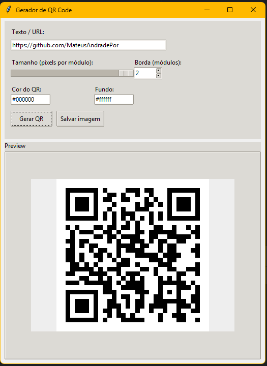

# QR Code Generator

Simples gerador de QR Code com interface intuitiva. Projeto em Python com uso do `tkinter`.

---

## Funcionalidades

- Interface gráfica simples e intuitiva;
- Opção para salvar imagem em .PNG de forma rápida;
- Mensagens de erro para evitar QR Codes inutilizáveis;
- Geração super rápida e eficaz;
- Opções de personalização de cor para o QR Code.

---

## Interface


---

## Requisitos

- Python 3.x
- `tkinter`
- `qrcode[pill] Pillow`

Instale os requisitos através do requirements.txt:

```bash
pip install requirements.txt

```

---

## Execução

### Clone o repositório

```bash
git clone https://github.com/MateusAndradePor/ProjetosDiversosPython/########

python3 qr_generator.py

```


