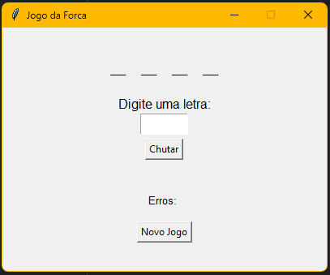

# Jogo da Forca (Python)

Jogo da forca básico com interface gráfica, feito em Python com `tkinter`. 
As palavras são carregadas a partir de um arquivo `.txt` externo.
---

## Funcionalidades

- Interface gráfica simples e interativa
- Palavras sorteadas aleatoriamente de um arquivo `.txt`
- Mensagens de acerto, erro, vitória e derrota
- Botão para reiniciar o jogo
- Validação de letras repetidas e inválidas

---

## Interface


---

## Requisitos

- Python 3.x
- `tkinter`

---

## Execução

### Clone o repositório

```bash
git clone #
cd JogoForca

python3 jogo_forca_main.py

```


